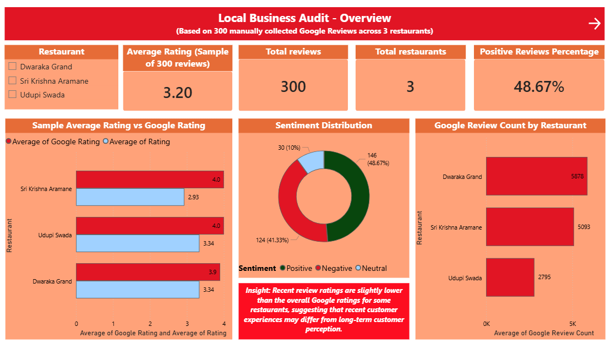
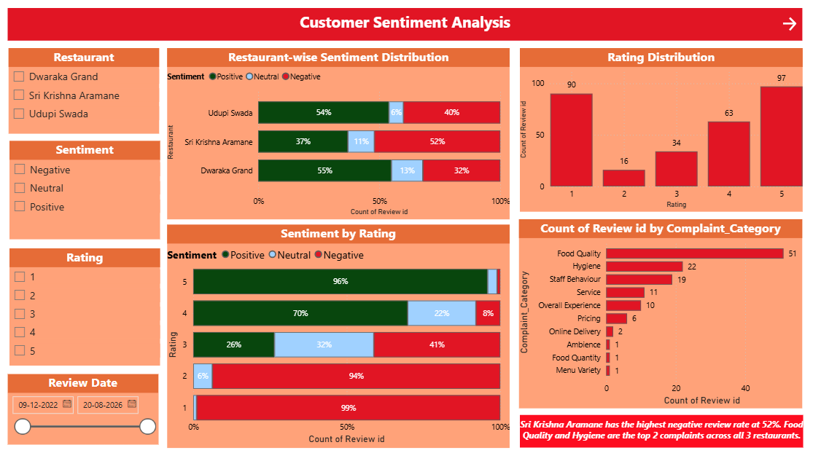
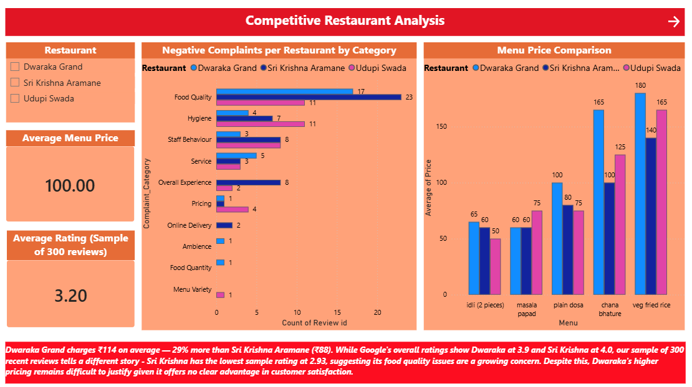
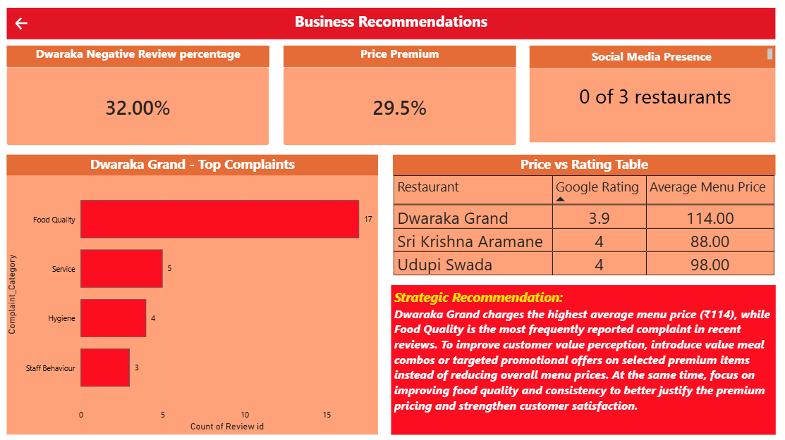

# 🍽️ Local Business Audit — Restaurant Analysis Dashboard

## 📌 Project Overview
A data analytics project auditing 3 restaurants in Kumaraswamy Layout, Bangalore using 300 manually collected Google Reviews. The goal was to identify where the primary business (Dwaraka Grand) is losing customers, what competitors are doing better, and recommend ONE data-backed action to improve customer satisfaction.

---

## 🏪 Businesses Analyzed
| Restaurant | Role | Google Rating | Avg Menu Price |
|---|---|---|---|
| Dwaraka Grand | Subject (Audit Target) | 3.9 | ₹114 |
| Udupi Swada | Competitor 1 | 4.0 | ₹98 |
| Sri Krishna Aramane | Competitor 2 | 4.0 | ₹88 |

---

## 📊 Dashboard Pages
### Page 1 — Overview
High level summary: average ratings, total reviews, sentiment distribution and Google review counts across all 3 restaurants.

### Page 2 — Customer Sentiment Analysis
Restaurant-wise sentiment breakdown (Positive/Negative/Neutral), rating distribution, sentiment by rating, and complaint category analysis — filtered by restaurant, sentiment, rating and date range.

### Page 3 — Competitor Comparison
Side by side negative complaint comparison per category across all 3 restaurants, and menu price comparison chart showing Dwaraka Grand's pricing premium.

### Page 4 — Executive Insights & Recommendations
KPI cards (32% negative rate, 29% price premium, 0 social media presence), top complaints for Dwaraka Grand, price vs rating table, and final data-backed recommendation.

---

## 🔍 Key Findings
1. **Dwaraka Grand charges 29% more** than the cheapest competitor (Sri Krishna Aramane — ₹88 avg) yet has the **lowest Google rating (3.9)**
2. **Food Quality (51 complaints) and Hygiene (22 complaints)** are the top 2 negative complaint categories across all 3 restaurants
3. **None of the 3 restaurants** have any active Instagram or Facebook presence — a missed opportunity for customer engagement
4. Recent review ratings are slightly lower than overall Google ratings, suggesting **customer satisfaction may be declining over time**

---

## ⭐ Final Recommendation
Dwaraka Grand should introduce **Value Meal combos at a 10-15% discount** on high-complaint, high-price items (Chana Bhature ₹165, Veg Fried Rice ₹180). This directly addresses the #1 customer complaint — poor value for money — and closes the 29% price gap vs competitors without changing base menu prices.

**Expected Impact:** Improved value perception, higher repeat visits, and potential rating improvement from 3.9 toward competitor levels (4.0)

---

## 🛠️ Tools Used
- **Data Collection:** Manual (Google Maps — 100 reviews per restaurant)
- **Data Cleaning & Tagging:** Microsoft Excel (Pivot Tables, manual sentiment tagging)
- **Data Modeling:** Power BI (Star Schema — 4 tables, 3 relationships)
- **Dashboard:** Power BI Desktop (4 pages, 15+ visuals)

---

## 📁 Files in this Repository
| File | Description |
|---|---|
| `Local business audit.xlsx` | Raw data — 300 reviews, restaurant info, menu prices, dashboard data |
| `Local_business_audit_dashboard.pbix` | Power BI dashboard file |
| `Page1_overview.png` | Dashboard screenshot — Overview |
| `Page2_sentimentAnalysis.png` | Dashboard screenshot — Sentiment Analysis |
| `Page3_Competitor_comparison.png` | Dashboard screenshot — Competitor Comparison |
| `Page4_recommendations.png` | Dashboard screenshot — Recommendations |

---

## 📸 Dashboard Preview

### Overview

### Customer Sentiment Analysis

### Competitor Comparison

### Executive Insights & Recommendations

